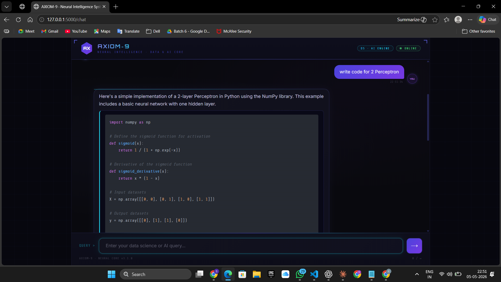

# 🤖 AI Chatbot using LLM (Groq + LangChain)

An end-to-end AI-powered chatbot web application built using **Flask**, **LangChain**, and **Groq LLMs**.
This project provides a real-time conversational interface similar to ChatGPT, with a modern UI and scalable backend architecture.

---

## 🚀 Features

* 💬 Real-time conversational chatbot
* 🧠 Powered by LLM (Groq – LLaMA 3)
* 🧩 Modular architecture (App Factory Pattern)
* 🔐 Secure API key management using `.env`
* 🧠 Conversation memory support
* ⚡ Fast responses via Groq inference
* 🎨 Clean and modern UI (HTML + CSS + JS)
* 📦 Easily extendable to RAG (Retrieval-Augmented Generation)

---

## 🏗️ Project Structure

```
CUSTOM_CHAT_BOT_USING_RAG/
│
├── .env                     # API keys (not pushed to GitHub)
├── main.py                  # Entry point
│
├── chatbot/
│   ├── app.py               # Flask app factory & routes
│   ├── model.py             # LLM + memory logic
│   ├── prompt.py            # Custom prompt template
│
├── templates/
│   ├── chat.html            # Chat UI
│   └── index.html           # Redirect / entry page
│
├── static/
│   └── style.css            # UI styling
│
├── logger.py                # Logging utility
├── requirements.txt         # Dependencies
└── README.md
```

---

## ⚙️ Installation

### 1️⃣ Clone the repository

```
git clone https://github.com/your-username/your-repo-name.git
cd your-repo-name
```

---

### 2️⃣ Create virtual environment

```
python -m venv venv
source venv/bin/activate   # Mac/Linux
venv\Scripts\activate      # Windows
```

---

### 3️⃣ Install dependencies

```
pip install -r requirements.txt
```

---

### 4️⃣ Setup environment variables

Create a `.env` file in the root folder:

```
GROQ_API_KEY=your_api_key_here
```

---

## ▶️ Running the Application

```
python main.py
```

Open in browser:

```
http://127.0.0.1:5000
```

---

## 🧠 How It Works

1. User enters a query in the chat UI
2. Frontend sends request to `/ask` API
3. Flask backend processes the request
4. LangChain + Groq LLM generates response
5. Response is sent back and displayed in UI

---

## 🔐 Security

* API keys are stored securely in `.env`
* Never exposed to frontend
* `.env` should be added to `.gitignore`

---

## 🛠️ Tech Stack

* **Backend:** Flask
* **LLM:** Groq (LLaMA 3)
* **Framework:** LangChain
* **Frontend:** HTML, CSS, JavaScript
* **Environment Management:** python-dotenv

---

## 🚀 Future Improvements

* 🔍 Add RAG (Qdrant / FAISS vector DB)
* 📄 PDF / document ingestion
* 🧠 Advanced memory (chat history persistence)
* 🌐 Deployment (Render / AWS / Docker)
* 🎙️ Voice-based interaction

---

## 📸 Demo (Optional)

*Add screenshots or demo GIF here*


---

## 🤝 Contributing

Contributions are welcome!
Feel free to fork the repo and submit a PR.

---

## 👨‍💻 Author

**Siddhant Panigrahi**

* LinkedIn: https://www.linkedin.com/in/siddhantpanigrahi23
* Email: [siddhantpanigrahi6@gmail.com](mailto:siddhantpanigrahi6@gmail.com)

---


---
